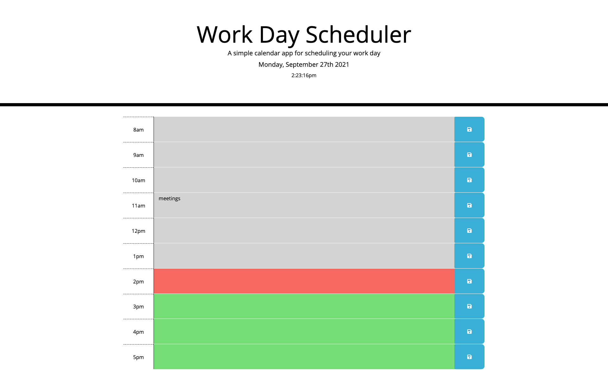

# work-day-scheduler-HW-05
Week 5 Homework - Work Day Scheduler

# Summary
A simple workday calendar which functions as below
- Allows the user to save events in each hour of the workday
- When the page is refreshed, the saved events will save to the users local storage, and remain in place
- The timeslot will change colour depending on the time of day, to let the user know where they are at in the work day
- When the hour is in the past, the timeslot colour is grey
- When the hour is in the present, the timeslot colour is red
- When the hour in in the future, the timeslot colour is green

# Screenshot

# Links
Github: https://github.com/nicoletr/work-day-scheduler-HW-05   
Deployed Application: https://nicoletr.github.io/work-day-scheduler-HW-05/